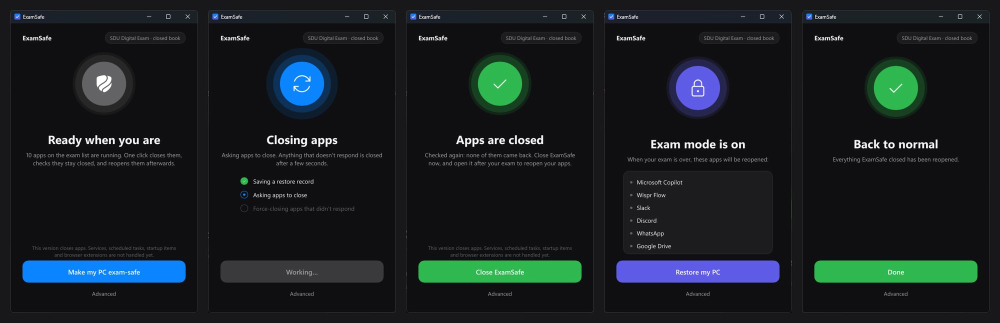

# ExamSafe

One click to make your PC exam-safe, and one click to put everything back afterwards.



**Status:** early version. Closing and reopening **apps** works and is tested end to end. Services, scheduled tasks, startup items and browser extensions are not handled yet.

## Why I made it

As a student who also works and uses AI tools a lot, my PC is three machines in one: study, job and AI workbench. A lot of things run by themselves - startup apps, scheduled tasks, services, sync clients, dev servers, AI helpers, etc. Turning off an app's startup toggle is often not enough, because its service or helper process keeps running anyway.

So before every exam I would walk through all of it by hand, still worry that I had missed something, and then have to remember what to turn back on afterwards. ExamSafe is meant to do that for me: look at what is running, close what is relevant for the exam, check that it actually worked, and restore everything when the exam is over.

## The rules it is built around

- **Check, don't assume.** After a fix, the app checks again, and it only says the PC is ready when that check passes.
- **Never cause problems afterwards.** Every change is written to a journal *before* it is made, so it can be undone - also after a crash or a reboot.
- **Ask before losing work.** Anything with a window that could hold unsaved work is asked about first and never force-closed silently.
- **Never look like cheating.** ExamSafe does not run during the exam, does not touch the exam software and does not hide anything from it.

The full product design and the reasoning behind it is in [`docs/IDEA.md`](docs/IDEA.md).

## How it is built

- **Rust**, with a [Slint](https://slint.dev) UI and a tray icon. Windows first, but the core has no Windows code in it, so macOS/Linux should be possible later.
- Four crates with strict rules about what may depend on what: `core` (the exam flow as a pure state machine, no OS calls), `platform` (the Windows code, and the only place `unsafe` is allowed), `helper` (a small privileged mode for the things that need admin rights) and `app` (the UI).
- The flow takes events and returns effects, so every transition, including failures and retries, is unit tested without a UI.
- The architecture rules are checked by a script in CI, clippy warnings count as errors, and there is an end-to-end test that runs the real exe against a real app.

More in [`docs/ARCHITECTURE.md`](docs/ARCHITECTURE.md).

## Build and run (Windows)

Requires Rust (stable, MSVC toolchain).

Portable exe (recommended):

```bash
pwsh ./tools/build-portable.ps1
```

Then run `dist\ExamSafe.exe` - copy it anywhere, no installer needed.

For development: `cargo run -p examsafe-app`.

## Quality gate

```bash
cargo fmt --all --check
cargo clippy --workspace --all-targets -- -D warnings
cargo test --workspace
pwsh ./tools/check-architecture.ps1
pwsh ./tools/e2e-charmap.ps1   # real exe vs a real app (after cargo build --release)
```

© 2026 Mikkel Blom. All rights reserved.
