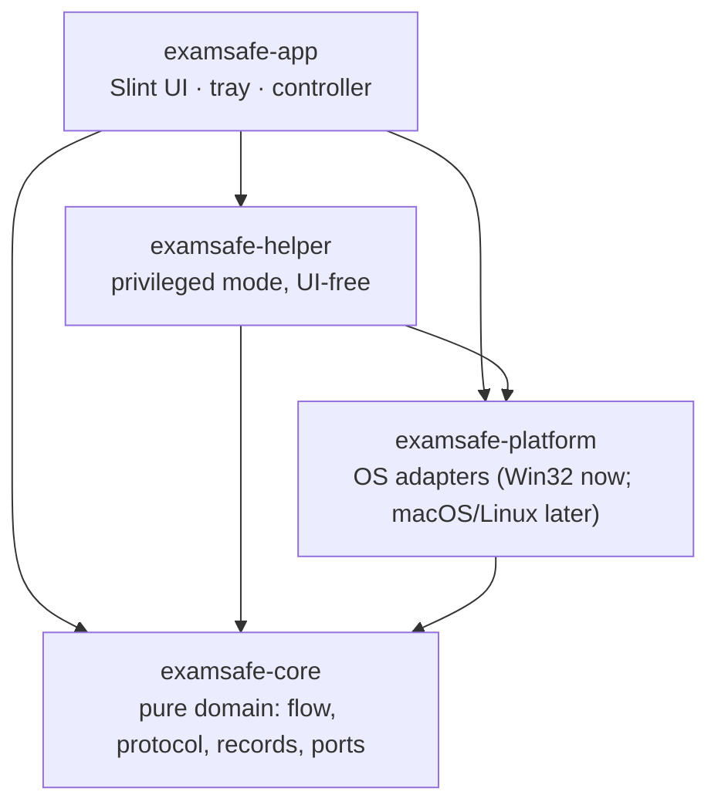

# ExamSafe — Architecture

> Product design and reasoning: [IDEA.md](IDEA.md). This file covers how the code is organised
> and the rules that keep it that way.

## Layers



| Crate | Responsibility | May depend on | Must never depend on |
|---|---|---|---|
| `examsafe-core` | Exam flow state machine, app catalog + matching + close/restore rules (`apps`), application service (`service`), helper protocol, exam-mode journal, **ports** (traits) | serde, thiserror | UI, OS APIs, other ExamSafe crates |
| `examsafe-platform` | Implements the ports for the current OS: process control (list / polite close / force close / relaunch), elevation, storage, helper client. **Only place with `unsafe`**, confined to `*_impl.rs` | core, `windows` | UI, app, helper |
| `examsafe-helper` | Privileged mode (library): one request in (command line), one response out, then exit. The app exe runs it when started as `ExamSafe.exe --helper --request <hex>`, before any UI exists | core, platform | UI |
| `examsafe-app` | Slint UI (`ui/*.slint`), tray, controller (window), `cli` (same flow without a window) | everything above | — |

Enforced in CI by [`tools/check-architecture.ps1`](../tools/check-architecture.ps1) (dependency
rules + `unsafe` exemptions) and by workspace lints (`unsafe_code = "deny"`,
`unwrap_used`/`expect_used` warn, clippy warnings are errors).

## Key patterns

- **Pure state machine.** `core::flow::Flow` takes `Event`s and returns `Effect`s. The app's
  controller executes effects and feeds results back as events. All transitions, including
  failure and retry, are unit tested without a UI.
- **Ports and adapters.** Core defines `ExamModeRepository` and `PrivilegedExecutor`; platform
  implements them. Tests (and future macOS/Linux ports) plug in different implementations.
- **Journal first.** `Effect::BeginExamMode` is always emitted *before* `Effect::RunFix`, and the
  controller stops executing effects when one fails, so nothing changes before it is recorded.
- **One service, two front-ends.** `core::service::run_effect` does the real work for every flow
  effect. The window (on a worker thread) and `ExamSafe.exe --cli` both call it, so they cannot
  drift apart — and the CLI doubles as the end-to-end test harness.
- **Close politely, then force.** Apps first get WM_CLOSE on their main windows (like clicking X),
  then a grace period (4 s), then are force-closed. The user confirms the list first.
- **Presentation-only UI.** `.slint` files contain layout, styling and animation only. Tokens
  (colours, type, motion) live in `ui/theme.slint`; nothing else hard-codes a colour.
- **Least privilege, one exe.** The app never runs as admin. For privileged work it relaunches
  its own executable through UAC in helper mode (`--helper`), which is dispatched in `main` before
  any window or tray exists. The request is passed on the command line (fixed at launch, cannot be
  swapped); the response path is validated by the helper. One portable exe, and the UAC prompt
  names ExamSafe itself.

## Testing

| Level | Where | Runs in CI |
|---|---|---|
| Unit — domain | `examsafe-core` (`flow`, `protocol`, `exam_mode`, `steps`) | ✓ |
| Unit — flow + service with a fake OS | `core::service` tests drive make-safe → restore end to end against `FakeControl` | ✓ |
| Integration — real Windows processes | `examsafe-platform` (list, describe, terminate a real process; polite close of a real window is `--include-ignored`) | ✓ (window test manual) |
| Unit — adapters | file store round-trip, corrupt file, helper arg parsing | ✓ |
| **End to end — real exe, real app** | `tools/e2e-charmap.ps1`: scan → make-safe → verify closed → restore → verify reopened, using Character Map and an isolated state folder | manual |
| Unit — app | tray icon rendering | ✓ |
| Architecture | `tools/check-architecture.ps1` | ✓ |
| Performance | `tools/measure.ps1` (startup, RAM, idle CPU) | manual |
| UI (headless) | `examsafe-app/src/ui_tests.rs`: texts, button labels, enabled state and actions per phase via Slint's testing backend and accessibility labels (needs element debug info, enabled for debug builds in `build.rs`) | ✓ |

Commands:

```bash
cargo fmt --all
cargo clippy --workspace --all-targets -- -D warnings
cargo test --workspace
pwsh ./tools/check-architecture.ps1
```

## Portable build

```bash
pwsh ./tools/build-portable.ps1
```

Produces `dist/ExamSafe.exe`: a single self-contained exe (~9 MB), no installer. State lives in
`%LOCALAPPDATA%\ExamSafe`, not next to the exe.

## Running

```bash
cargo run -p examsafe-app
```

Environment overrides (for development and tests):
`EXAMSAFE_CATALOG=<file>` uses another app list; `EXAMSAFE_STATE_DIR=<dir>` keeps the journal
elsewhere so tests never touch the real one.

Command line: `ExamSafe.exe --cli scan | make-safe --yes | restore | status`. The exam-mode record lives at `%LOCALAPPDATA%\ExamSafe\exam-mode.json`;
delete it to reset.

## Current scope (2026-09-30)

**Apps are real:** detected from `catalog/apps.json`, confirmed by the user, closed (politely,
then forced), re-verified, journaled, and reopened on restore. **Not yet handled:** services,
scheduled tasks, startup items, browser extensions, network adapters — the UI says so.
