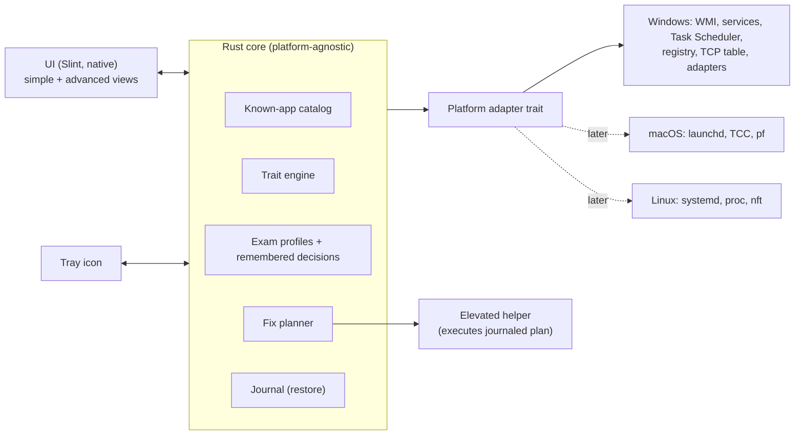

# ExamSafe — Idea & Design

> Status: **idea / design phase**. Nothing is built yet. This document is the source of truth for
> what we are building and why. Last updated 2026-09-30.

---

## 1. The problem

A student who also works and uses AI has a PC that is three machines in one: study, job and AI
workbench. Things run by themselves — startup apps, scheduled tasks, services, sync clients,
databases, dev servers, AI helpers, browser extensions. Turning off an app's startup toggle is not
enough; its service, scheduled task or helper process keeps running anyway.

Before every exam you manually walk through startup apps, scheduled tasks and job lists, and still
worry you missed something. After the exam you have to remember what to turn back on. That is
stressful, error-prone, and the cost of a miss is failing the exam.

## 2. The product in one sentence

**A clean, native-feeling desktop app that tells you in one glance whether your PC is exam-safe for
*this specific exam*, fixes it with one button, proves the fix worked, and puts everything back
afterwards.**

Audience: Mikkel first (baseline machine), then any student — including non-technical ones.

## 3. Principles (the things that must never be violated)

1. **Trustworthy over clever.** Never "fire and forget". Every fix is followed by a re-check, and
   the app only says "Exam safe" when the re-check proves it.
2. **Never bite you afterwards.** Every change is journaled *before* it is made, is reversible,
   survives a crash or reboot, and restore is itself verified.
3. **Ask before losing work.** Anything with a window that could hold unsaved work is asked about
   first, never force-killed silently.
4. **Never look like cheating.** ExamSafe must not run during the exam, must not touch the exam
   software, and must not hide anything from it. It is a compliance tool, not an evasion tool.
5. **Explain every verdict.** "Flagged because: listens on the network + remote-input capability"
   — never a black box.
6. **Light.** Near-zero CPU/RAM when idle; nothing at all running during the exam.
7. **Portable core.** Windows first, but no design decision that locks us out of macOS/Linux.

## 4. The experience

### Design rule: one click by default, full control when asked

- **By default ExamSafe turns off everything relevant** for the chosen exam profile. The user does
  not pick items; they press one button.
- The simple view has as few decisions, buttons and worries as possible.
- **Advanced settings are hidden** unless you choose to open them. There, everything is
  transparent and customizable: exactly what is closed, stopped, disabled, blocked or left alone,
  per item and per category, and with which method (close / terminate / stop service / disable
  service / disable task / disable startup / policy block / disable adapter).

### The exam flow (decided 2026-09-30)

```
 Open ExamSafe ──► [ Make my PC exam-safe ] ──► fixing + re-checking ...
                                                      │
                                         "Everything is ready ✓"
                                                      │
                                      [ Close ExamSafe ]  ← app exits completely
                                                      │
                                              ── take exam ──
                                                      │
 Open ExamSafe ──► app is in "exam mode" and shows ONE thing: [ Restore my PC ]
                                                      │
                                   restore + verify ──► "Back to normal ✓"
```

- Pressing **Close ExamSafe** is the only way to finish; the app is gone before ExamMonitor starts.
- While the PC is in exam mode, opening ExamSafe always leads to **Restore my PC** first.
- Timed automatic restore is a planned *later* addition (see `ai-instructions/FUTURE_IDEAS.md`).

### Simple view (default — for everyone)

```
 ┌──────────────────────────────────────────────┐
 │  Exam:  SDU Digital Exam – closed book   ▾   │
 │                                              │
 │              ●  Not exam-safe yet            │
 │           7 things need attention            │
 │                                              │
 │   AI assistants        3   ›                 │
 │   Remote access        2   ›                 │
 │   File sync            1   ›                 │
 │   Checklist (manual)   4   ›                 │
 │                                              │
 │          [  Make my PC exam-safe  ]          │
 └──────────────────────────────────────────────┘
```

The only prompts the simple view ever shows are the unavoidable ones: "these apps may have unsaved
work — close them?" and "ExamSafe doesn't know X — allow or block?" (remembered afterwards).

### Advanced view (for power users)

Everything, live, with the verdict and the reason for each row:

- Processes (with publisher/signature, parent, command line)
- Services, scheduled tasks (incl. next run time), startup entries — all persistence points
- Network: live connections per process, listening ports, network adapters (VPN/virtual)
- Browser extensions per browser/profile, browser AI features (Gemini in Chrome, Edge Copilot)
- IDE extensions and AI settings (VS Code family, JetBrains)
- OS AI features (Windows Copilot, Recall, Click to Do, cloud clipboard)
- The journal: what ExamSafe changed, when, and its restore status

Filters: *blocked / allowed / unknown / changed by ExamSafe*.

### Tray icon

Windows tray icons support: **hover = tooltip only** (text, e.g. "ExamSafe — 3 issues"),
**left-click** = anything we like (we use a small popover: status + Check / Fix / Restore),
**right-click** = context menu. macOS menu bar and Linux (AppIndicator) support the same pattern,
so this is portable.

## 5. Exam profiles (settings per exam)

Exams differ, so safety is always *relative to a profile*. A profile is a list of permissions:

| Permission | Example values |
|---|---|
| AI (cloud & local) | never / allowed |
| Internet | none / allowed / allowed except AI sites |
| Communication (chat, mail, calls) | never / allowed |
| File sync & cloud drives | off / allowed |
| Remote access & screen sharing | never (always) |
| Own files & notes | allowed / not allowed |
| Specific allowed programs | "IntelliJ, VS Code (AI off), Word, PDF reader" |
| Background noise (work jobs, DBs, updaters) | stop / keep |

Presets ship with the app (e.g. *SDU Digital Exam + ExamMonitor — closed*, *Open book, no AI*,
*All aids except communication & AI*) and the user can clone/edit them. Unknown items found
during a check are **asked about once and remembered** per profile.

## 6. Detection: three layers (like an antivirus)

### Layer 1 — Known catalog ("signatures")
A curated, updatable catalog of known apps: Claude, ChatGPT/Codex, Gemini, Copilot, Ollama,
LM Studio, Cline, OpenClaw, Cursor, TeamViewer, AnyDesk, Google Drive, OneDrive, Dropbox, Slack,
Discord… Each entry lists all its footprints: executables, **code-signing publisher**, services,
scheduled tasks, startup entries, browser extension IDs, IDE extension IDs, ports, domains.
Matching on the signed publisher (not just the exe name) makes it robust to renamed files.

### Layer 2 — Trait detection ("behaviour")
Catches things the catalog does not know yet, from observable, deterministic traits. Each hit
explains itself. Examples:

| Category | Traits we can observe (deterministic) |
|---|---|
| **Local AI** | Process serves an OpenAI/Ollama-compatible API on localhost (probe `/v1/models`, `/api/tags`); has large model files (`.gguf`, `.safetensors`) mapped; heavy GPU compute |
| **Cloud AI** | Non-browser process connects to known AI API endpoints (api.openai.com, api.anthropic.com, generativelanguage.googleapis.com, …); config dirs like `~/.claude`, `~/.codex`, `~/.gemini`, `~/.cline`; MCP server command lines |
| **Remote access** | Listens on the network or holds a persistent relay connection **and** can inject input / capture the screen; runs as a SYSTEM service with an interactive component |
| **File sync** | Registered cloud-files sync root (Windows `SyncRootManager`), shell overlay icon handlers, virtual drive, file watchers on user folders + constant HTTPS |
| **Hidden overlays** | Windows marked *excluded from screen capture* (`WDA_EXCLUDEFROMCAPTURE`) — the signature of "invisible cheating overlay" apps; always-on-top transparent windows |
| **Device link** | Phone-link sync roots, Bluetooth/PAN, cross-device clipboard |
| **Virtualization** | Hypervisor present, VM/WSL processes, virtual network adapters |
| **Persistence** | Anything that will start *by itself* in the next N hours: services set to Auto, enabled tasks with a next-run time inside the exam window, startup entries, restart-on-failure services |

### Layer 3 — Ask & remember
Anything neither layer can classify is shown as **Unknown** with its evidence, and the user decides
once (allow / block, per profile). Decisions are stored by stable identity
(publisher + product + path), not just by name.

## 7. Fixing — the "make it hard" part

1. **Plan.** Compute every change needed for the chosen profile. The simple view just runs it;
   the advanced view shows and lets you edit the full plan before running.
2. **Consent.** Apps with windows are asked about ("Slack — close? unsaved work will be lost").
   Try a graceful close first, force only after consent.
3. **Journal first.** Write the prior state of each item to a journal *before* changing it.
4. **Apply in the right order** — kill the resurrection paths first, then the process:
   scheduled tasks → startup entries → services (set Disabled, then stop) → policies → processes.
5. **Use the strongest reversible lever per item:**
   - Processes: close.  Services: disable + stop.  Tasks: disable.  Startup: disable (same flag
     Task Manager uses).
   - Browser extensions: browser **policy blocklist** (`ExtensionInstallBlocklist`) — officially
     supported, reversible, and cannot be undone by the extension. AI sites for "internet allowed,
     no AI" exams: policy `URLBlocklist`.
   - Browser AI features: policies (Chrome `GenAiDefaultSettings` / `GeminiSettings`, Edge
     `HubsSidebarEnabled`).
   - VS Code: `chat.disableAIFeatures: true`, plus disabling third-party AI extensions
     (Cline, Claude Code, Continue…) that the setting does not cover.
   - Windows AI: Copilot/Recall/Click-to-Do policies. Virtual/VPN adapters: disable.
6. **Verify.** Full re-scan. Only a clean re-scan earns "Exam safe ✓". Anything that came back
   (auto-restarting apps) is shown and fixed again.
7. **Ready + close.** "Everything is ready ✓" → the user presses **Close ExamSafe** and the app
   quits completely (no tray, no helper) so it never appears in the exam log as running.

Privilege model: the UI runs as a normal user. Changes that need admin go through a small
**elevated helper** started with one UAC prompt, which only executes the journaled plan.

### Restore
Triggered manually: the next time ExamSafe is opened after an exam, the only action offered is
**Restore my PC**. It replays the journal backwards, verifies each item is back, and keeps anything
that failed so it can be retried. Works after a reboot or crash because the journal is on disk.

Because default = "turn off everything relevant", the list can include things you never think
about. Restore brings back exactly what was on before, nothing more.

## 8. SDU / ExamMonitor specifics

SDU uses **Digital Exam + ExamMonitor**. ExamMonitor logs **running processes, browser URLs,
network adapters, screenshots, and checks for virtual machines**, and the data is reviewed
afterwards. Consequences for our design:

- ExamSafe must be **fully closed before ExamMonitor starts**. No watcher, no tray, no scheduled
  restore firing mid-exam. Everything happens *before*.
- We must not kill things *after* ExamMonitor has started (a process vanishing mid-exam is odd).
- **Network adapters are logged**: VPN/virtual adapters (WireGuard, VirtualBox Host-Only, Cisco)
  are disabled by default (restored afterwards).
- **VM checks**: running VMs and WSL are stopped by default. A hypervisor that stays *present*
  (e.g. Windows security features use it) is reported, not changed.
- ExamSafe never touches ExamMonitor itself.

⚠ Uncertainty: the technical details above come partly from a 2019 public analysis of ExamMonitor
plus SDU's own description; the current version may collect more or less. Treat as likely,
not guaranteed. SDU's exam rules always win over what ExamSafe says.

## 9. Mikkel's PC — baseline findings (read-only survey, 2026-09-30)

What a first check would flag today:

- **AI:** Claude desktop + Cowork service + Chrome bridge; Claude Chrome extension; Claude Code CLI;
  Copilot (auto-starts); Wispr Flow (AI dictation); Ollama installed; itslearning MCP (`its.exe`);
  VS Code extensions *Claude Code*, *Cline*, *GitLab Workflow* (Duo AI); Rider with ACP agents;
  config dirs `~/.claude`, `~/.gemini`, `~/.cline`, `~/.copilot`, `~/.ollama`.
- **Remote access:** TeamViewer service listening (5939); ASUS GlideX remote service;
  **Chrome Remote Desktop extension**.
- **Device link:** Phone Link + Cross Device (registered sync roots), Samsung Quick Share,
  clipboard history on.
- **Communication / sync:** Slack running; Discord and Notion on startup; Google Drive running.
- **Network / VM:** WireGuard tunnel (Bitdefender VPN) up, VirtualBox Host-Only adapter up,
  hypervisor present (WSL2 Ubuntu + docker-desktop distros).
- **Work noise:** SQL Server listening on the whole network (1433), Node dev servers,
  "PMS Vulnerability Watch" scheduled task.
- **Needs a decision:** Tampermonkey (user scripts can do anything), Google Dictionary, PowerToys,
  Flow Launcher, Launchpad.
- **Harmless:** ASUS/Intel/NVIDIA/Razer/Wacom/Logitech utilities, Bitdefender (never touched).

Note how often the *startup toggle alone* would not have been enough: Claude, TeamViewer, GlideX,
SQL Server and Quick Share all run as **services**, and OneDrive/PowerToys/Ubisoft come back via
**scheduled tasks**.

## 10. Things ExamSafe cannot see (→ manual checklist in the app)

Some things aren't detectable, or aren't reliably detectable, so they become checklist items the
app shows and the user ticks:

- Phone, smartwatch, second computer, smart glasses
- Websites already logged in inside an allowed browser (partly covered by `URLBlocklist`)
- AI features *inside* allowed web apps (e.g. Word/Docs online with Copilot/Gemini)
- Notes/files on USB sticks
- Earbuds with assistants

## 11. Tech stack — decided: Rust + Slint (2026-09-30)

**Native, no Chromium wrapper.** Same philosophy as the classic Windows Task Manager: small, fast,
instant to open, no embedded browser. Slint was chosen because it used the least resources when
Mikkel tested it in another project, and it is native Rust on Windows, macOS and Linux.

What that means in practice:
- **UI:** Slint `.slint` markup with a *custom* design system (our own colours, type, spacing,
  motion) — not Slint's stock Fluent/Material styles, so it does not look like a generic app.
  Slint has built-in states, transitions and animations for the smooth, Apple-like feel.
- **Renderer:** start with the default (Skia/FemtoVG); evaluate Slint's software renderer if RAM
  matters more than GPU smoothness. Measure, don't guess.
- **Tray:** Slint has no tray API of its own (as far as I know — verify in the spike); use the
  standalone `tray-icon` crate (native Win32 / AppKit / AppIndicator, no WebView).
- **Windows APIs:** the `windows` crate (WMI, Service Control Manager, Task Scheduler COM,
  registry, IP helper for the TCP table, window display affinity).
- **Elevated helper:** a second small Rust binary with an admin manifest, started via UAC only
  when a fix/restore runs.
- **Licensing note:** Slint is available under GPLv3 or a royalty-free licence for desktop apps
  (with attribution). Fine for now; check the terms before any public/commercial release.

Architecture:



The catalog, traits and profiles are **data files** (versioned, updatable without a new release).

## 11b. Distribution & updates (designed now, built later)

Goal: people download ExamSafe once; after that we can ship fixes, new features and new
detections, and they get them automatically or with one click.

**Two update channels, because they change at very different speeds:**

| Channel | What | How often | How |
|---|---|---|---|
| **App updates** | The program itself | Occasionally | Signed installer + in-app updater |
| **Catalog updates** | Known apps, traits, exam presets (data files) | Often — new AI tools appear weekly | Signed data bundle downloaded by the app, no reinstall |

**App updates — proposed tooling:** [Velopack](https://velopack.io) (open-source installer +
updater with a Rust SDK; per-user install without admin, delta updates, rollback, GitHub
Releases / S3 as the source). Alternative: `cargo-packager` + its standalone updater.
Pipeline: git tag → GitHub Actions builds + signs → publishes release → apps see it.

**Rules specific to ExamSafe:**
- **No background updater service.** Nothing may run during the exam. Update checks happen only
  when the user opens ExamSafe.
- **No updates while in exam mode.** Between "Make safe" and "Restore", updating is blocked, so
  a restore journal is always read by the version that wrote it. The journal format is
  versioned anyway.
- **Everything signed:** Windows code signing (otherwise SmartScreen + antivirus will distrust a
  tool that needs admin and stops services), and a separate ed25519 key that signs update
  manifests and catalog bundles.
- **Channels:** `stable` for users, `beta` for Mikkel.
- **Privacy:** ExamSafe sees everything on the PC. Nothing is uploaded automatically; support
  uses an explicit "Export diagnostic report" the user reviews and sends.

**Gotchas to remember:**
- The source repo is private → release files there are not downloadable by the public. Use a
  separate public releases repo or a bucket (e.g. Cloudflare R2).
- Code signing costs money (Azure Trusted Signing is roughly $10/month, OV certificates
  ~$200–400/year); eligibility for individuals varies by country — verify before release.

## 12. Rough roadmap

1. ✅ **Slint prototype (2026-09-30):** custom-styled UI, full simulated flow, native tray,
   elevated helper handshake, CI + architecture guard. Measured 24.5 MB, ~0% idle CPU, 125 ms
   startup. See `docs/ARCHITECTURE.md`.
2. **Read-only engine:** Windows inventory + catalog + traits; advanced view. No changes to the PC yet.
3. **Profiles + simple view:** exam presets, the one-glance verdict, ask & remember.
4. **Fix + journal + restore:** elevated helper, verification loop, crash-safe restore.
5. **Browser/IDE/OS AI controls** via policies and settings.
6. **Polish:** animations, onboarding, tray popover, "Ready → Close ExamSafe" flow.
7. **Distribution:** signed installer, in-app updater, catalog update channel, beta channel.
8. **Generalize:** bigger catalog, community presets per university, macOS, then Linux.

## 13. Open decisions

See `ai-instructions/WORKING_NOTES.md` → *Open decisions*.
